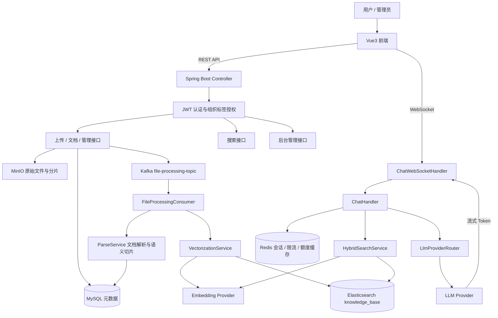
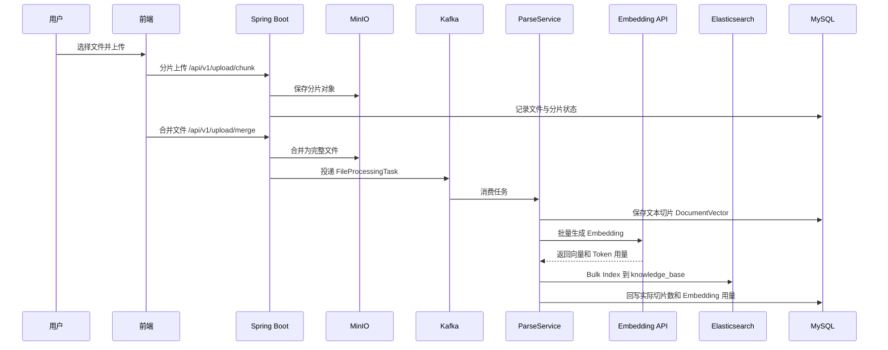
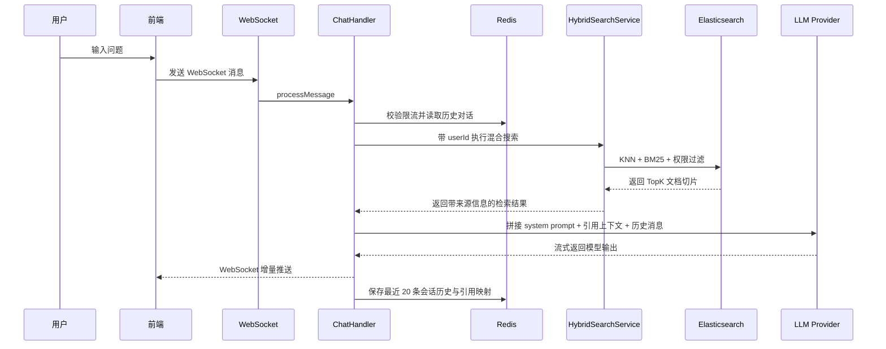

# RAG Smart FlowPAI

> 一个面向企业知识库场景的全栈 RAG 问答系统。项目覆盖文档上传、异步解析、向量化索引、混合检索、权限隔离、流式 AI 对话、用量计费与后台管理等完整链路，适合作为 Java 后端 / 全栈方向面试项目展示。

## 项目亮点

- **完整 RAG 闭环**：文档上传后自动完成解析、切片、Embedding、Elasticsearch 向量索引，并在聊天时检索上下文增强 LLM 回复。
- **异步文件处理**：使用 Kafka 解耦上传与解析向量化流程，支持失败重试与死信队列，提高大文件处理的稳定性。
- **混合检索策略**：Elasticsearch 同时做向量 KNN 与文本匹配，并用 BM25 rescore 优化结果排序。
- **多租户权限控制**：文档按用户、公开状态、组织标签过滤，搜索和问答阶段都只返回用户有权限访问的知识。
- **流式对话体验**：WebSocket 推送 LLM 增量输出，前端实时渲染回复，并保留引用来源。
- **工程化配套**：Spring Security + JWT、Redis 限流与会话缓存、Token 额度统计、MinIO 对象存储、Docker 基础设施脚本、Vue3 管理端。

## 技术栈

| 层级 | 技术 |
| --- | --- |
| 后端 | Java 17, Spring Boot 3.4, Spring MVC, Spring Security, WebSocket, WebFlux WebClient |
| 数据与中间件 | MySQL 8, Redis, Kafka, Elasticsearch 8, MinIO |
| AI 能力 | OpenAI-compatible Chat Completion, DeepSeek, DashScope Embedding, 可配置模型 Provider |
| 文档处理 | Apache Tika, PDFBox, HanLP 中文分词 |
| 前端 | Vue 3, TypeScript, Vite, Pinia, Vue Router, Naive UI, UnoCSS |
| 工程工具 | Maven, pnpm, Docker Compose, shell 部署脚本 |

## 系统架构



## RAG 核心流程

### 文档入库链路



### 问答检索链路



## 后端模块说明

| 模块 | 说明 |
| --- | --- |
| `controller` | 暴露 REST API，覆盖登录注册、上传、文档、搜索、聊天令牌、后台管理、充值等入口 |
| `service` | 核心业务层，包含上传合并、解析、向量化、混合检索、对话、额度、限流、模型 Provider 路由 |
| `consumer` | Kafka 消费者，异步执行文件解析和向量化 |
| `client` | LLM 与 Embedding API 客户端，兼容 OpenAI 风格接口 |
| `repository` | Spring Data JPA 数据访问层 |
| `config` | 安全、Kafka、Redis、ES、MinIO、WebSocket、跨域、初始化任务等配置 |
| `model` / `entity` | JPA 实体、ES 文档、请求响应对象和任务模型 |

## 主要功能

### 知识库管理

- 支持文档分片上传、上传状态查询、合并、下载、预览和删除。
- 文件存储在 MinIO，文件元数据、分片信息和文本切片存储在 MySQL。
- 上传完成后自动投递 Kafka 任务，后台异步解析并建立向量索引。

### 文档解析与向量化

- 使用 Apache Tika 自动识别多种文档格式。
- PDF 使用 PDFBox 做页级解析，保留页码与锚点信息，方便回答时展示来源。
- 对非 PDF 文档采用流式解析，降低大文件导致 OOM 的风险。
- 使用 HanLP 辅助中文语义切片，切片后批量调用 Embedding API。

### 混合检索

- 查询阶段先生成 query embedding。
- Elasticsearch 使用 KNN 召回候选切片。
- 同时使用关键词匹配和 BM25 rescore，提高中文问答场景下的相关性。
- 搜索条件中加入 `userId`、`public`、`orgTag` 过滤，保证用户只能检索有权限的文档。

### AI 对话

- 聊天入口采用 WebSocket，前端可以实时收到模型输出。
- `ChatHandler` 负责读取历史消息、执行检索、构造上下文、调用 LLM、保存对话。
- Prompt 中强制模型基于参考资料回答，并要求输出来源编号。
- Redis 保存当前会话和最近历史，提高多轮问答连续性。

### 权限、限流与额度

- Spring Security + JWT 实现无状态认证。
- 组织标签过滤器提供多租户知识访问控制。
- Redis 限流保护注册、登录、聊天、LLM 请求和 Embedding 请求。
- 支持 Token 额度预估、预占、结算和回滚，便于做 SaaS 化用量控制。

### 管理端与商业化扩展

- 管理端支持用户、组织标签、邀请码、模型 Provider、限流配置、用量看板、充值套餐等管理。
- 微信支付相关配置和充值订单模型已接入，为商业化订阅或按量付费预留能力。

## 前端页面

| 页面 | 说明 |
| --- | --- |
| `chat` | 知识库对话，支持流式回复、Markdown 渲染、引用预览 |
| `knowledge-base` | 文档上传、知识库列表、搜索与管理 |
| `chat-history` | 会话历史查看 |
| `personal-center` | 用户信息与个人设置 |
| `user` / `org-tag` | 用户与组织标签管理 |
| `model-provider` | LLM / Embedding Provider 配置 |
| `usage-monitor` | 用量监控 |
| `invite-code` | 邀请码管理 |
| `recharge` / `recharge-manage` | 充值与套餐管理 |

## 关键接口

| 接口前缀 | 功能 |
| --- | --- |
| `/api/v1/users` | 注册、登录、当前用户、组织标签、用量、登出 |
| `/api/v1/auth` | Refresh Token |
| `/api/v1/upload` | 分片上传、上传状态、合并、支持类型 |
| `/api/v1/documents` | 文档列表、删除、重建索引、下载、预览、引用详情 |
| `/api/v1/search` | 混合检索 |
| `/api/v1/chat` | WebSocket 临时令牌 |
| `/api/v1/admin` | 用户、知识库、组织、邀请码、模型配置、限流、用量、充值套餐 |
| `/api/v1/recharge` | 充值套餐、创建订单、支付回调、订单查询 |

## 本地运行

### 1. 准备环境

- JDK 17
- Maven 3.8+
- Node.js 18.20+
- pnpm 8.7+
- Docker / Docker Compose

### 2. 配置环境变量

复制示例配置并填写真实密钥：

```bash
cp .env.example .env
```

重点配置项：

```bash
JWT_SECRET_KEY=Base64编码的JWT密钥
DEEPSEEK_API_KEY=你的LLM API Key
EMBEDDING_API_KEY=你的Embedding API Key
SPRING_DATASOURCE_URL=jdbc:mysql://localhost:3306/PaiSmart
SPRING_DATA_REDIS_PASSWORD=本地Redis密码
ELASTICSEARCH_PASSWORD=本地ES密码
MINIO_ACCESS_KEY=MinIO账号
MINIO_SECRET_KEY=MinIO密码
```

### 3. 启动基础设施

```bash
docker compose -f docs/docker-compose.yaml up -d
```

或使用项目脚本：

```bash
./infra.sh start
./infra.sh status
./infra.sh urls
```

### 4. 初始化数据库

```bash
mysql -uroot -p PaiSmart < docs/databases/ddl.sql
```

如果使用 JPA 自动建表，可根据环境设置：

```bash
SPRING_JPA_HIBERNATE_DDL_AUTO=update
```

### 5. 启动后端

```bash
mvn spring-boot:run
```

默认端口：

```text
http://localhost:8081
```

### 6. 启动前端

```bash
cd frontend
pnpm install
pnpm run dev
```

## 构建与测试

后端测试：

```bash
mvn test
```

后端打包：

```bash
mvn clean package
```

前端类型检查与构建：

```bash
cd frontend
pnpm typecheck
pnpm build
```

## 面试讲解建议

### 30 秒介绍

这是一个企业知识库 RAG 问答系统。用户上传文档后，系统会通过 MinIO 存储原文件，用 Kafka 异步触发解析和向量化，把切片和向量写入 MySQL 与 Elasticsearch。用户提问时，后端会按权限执行混合检索，把召回内容拼进 Prompt，再通过 WebSocket 流式返回 LLM 答案和引用来源。项目里还做了 JWT、组织标签多租户、Redis 限流、Token 额度、模型 Provider 配置和后台管理。

### 可以重点展开的技术点

- **为什么用 Kafka**：上传请求只负责文件落库和投递任务，解析、Embedding、索引放到后台做，避免大文件阻塞 HTTP 请求；失败时通过重试和 DLT 提升可靠性。
- **为什么用混合检索**：纯向量搜索容易召回语义相近但关键词不准的内容，纯 BM25 又不理解语义；项目通过 KNN 召回 + 文本匹配 + rescore 兼顾语义和精确度。
- **权限如何下沉到检索层**：不是先查全部再在 Java 里过滤，而是在 ES 查询条件中加入用户、公开文档和组织标签过滤，减少越权风险和无效数据传输。
- **流式对话如何落库**：WebSocket 每收到模型 chunk 就推给前端，同时在服务端累积完整回复，完成后统一写入 Redis 会话历史。
- **额度如何控制**：调用 LLM / Embedding 前先做 token 预估和额度预占，成功后按实际 usage 结算，失败则回滚，避免并发场景下超用。

### 可优化方向

- 引入 reranker 或 Cross Encoder，提高 TopK 证据排序质量。
- 对长文档增加父子切片检索策略：小切片召回，大块上下文注入。
- 给 Kafka 消费任务增加可观测状态表，前端展示解析中、失败原因和重试状态。
- 对 ES 索引增加别名和版本迁移流程，降低 mapping 升级风险。
- 对 WebSocket 完成判断改为基于模型流结束事件，减少依赖定时检测。

## 目录结构

```text
.
├── src/main/java/com/yizhaoqi/smartpai
│   ├── client              # LLM 与 Embedding 客户端
│   ├── config              # Spring Security、Kafka、Redis、ES、MinIO、WebSocket 等配置
│   ├── consumer            # Kafka 文件处理消费者
│   ├── controller          # REST API 控制器
│   ├── entity              # ES 文档与请求响应对象
│   ├── exception           # 自定义异常
│   ├── handler             # WebSocket 处理器
│   ├── model               # JPA 实体与领域模型
│   ├── repository          # Spring Data JPA Repository
│   ├── service             # 业务服务与 RAG 核心流程
│   └── utils               # 工具类
├── src/main/resources
│   ├── application.yml     # 主配置
│   ├── application-dev.yml
│   ├── application-prod.yml
│   └── es-mappings         # Elasticsearch mapping
├── frontend                # Vue3 + TypeScript 前端
├── docs
│   ├── docker-compose.yaml # 本地基础设施
│   └── databases/ddl.sql   # 数据库 DDL
├── infra.sh                # 基础设施管理脚本
├── deploy-front.sh         # 前端部署脚本
└── pom.xml                 # 后端 Maven 配置
```

## License

MIT
