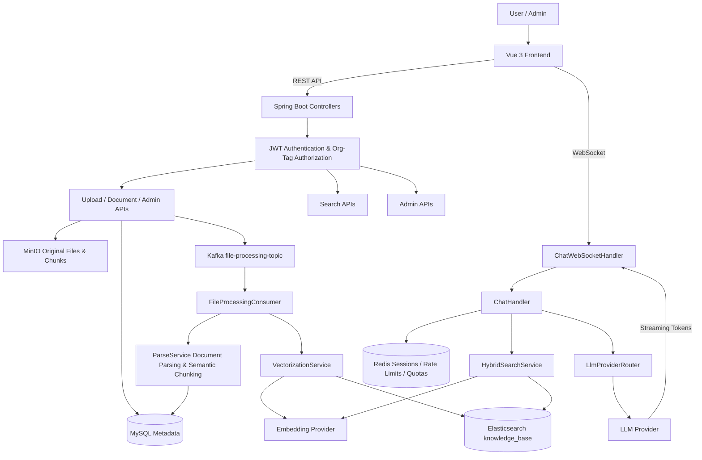
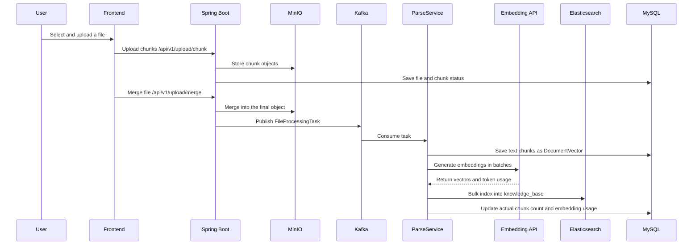
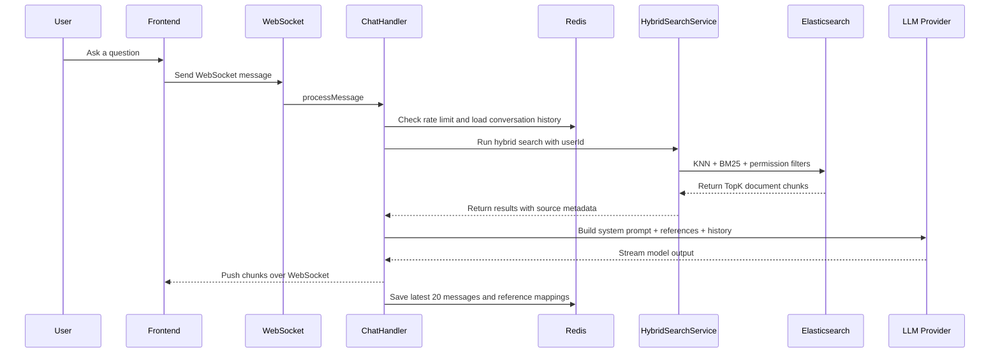

# RAG Smart FlowPAI

> A full-stack Retrieval-Augmented Generation system for enterprise knowledge-base scenarios. It covers the complete workflow from document upload, asynchronous parsing, vector indexing, hybrid retrieval, permission isolation, streaming AI chat, usage metering, and admin operations. This project is well suited for Java backend or full-stack engineering interview discussions.

## Highlights

- **End-to-end RAG pipeline**: Uploaded documents are parsed, chunked, embedded, indexed in Elasticsearch, and retrieved as grounded context during chat.
- **Asynchronous document processing**: Kafka decouples upload requests from parsing and vectorization, with retry and dead-letter handling for better reliability.
- **Hybrid retrieval**: Elasticsearch combines vector KNN retrieval with keyword matching and BM25 rescore to improve answer relevance.
- **Multi-tenant access control**: Documents are filtered by owner, public visibility, and organization tags so users only retrieve authorized knowledge.
- **Streaming chat experience**: WebSocket pushes LLM output chunks to the frontend in real time, while keeping source references available.
- **Production-oriented engineering**: Spring Security + JWT, Redis-based rate limiting and session cache, token quota accounting, MinIO object storage, Docker infrastructure scripts, and a Vue 3 admin console.

## Tech Stack

| Layer | Technologies |
| --- | --- |
| Backend | Java 17, Spring Boot 3.4, Spring MVC, Spring Security, WebSocket, WebFlux WebClient |
| Data & Middleware | MySQL 8, Redis, Kafka, Elasticsearch 8, MinIO |
| AI | OpenAI-compatible Chat Completion, DeepSeek, DashScope Embedding, configurable model providers |
| Document Processing | Apache Tika, PDFBox, HanLP Chinese segmentation |
| Frontend | Vue 3, TypeScript, Vite, Pinia, Vue Router, Naive UI, UnoCSS |
| Engineering | Maven, pnpm, Docker Compose, shell deployment scripts |

## Architecture



## RAG Workflow

### Document Ingestion



### Chat Retrieval



## Backend Modules

| Module | Description |
| --- | --- |
| `controller` | REST API layer for auth, upload, documents, search, chat token, admin operations, and recharge APIs |
| `service` | Core business logic for upload merge, parsing, vectorization, hybrid search, chat, quotas, rate limits, and model provider routing |
| `consumer` | Kafka consumers for asynchronous document parsing and vectorization |
| `client` | LLM and Embedding API clients compatible with OpenAI-style endpoints |
| `repository` | Spring Data JPA data access layer |
| `config` | Spring Security, Kafka, Redis, Elasticsearch, MinIO, WebSocket, CORS, and bootstrapping configuration |
| `model` / `entity` | JPA entities, Elasticsearch documents, request/response objects, and task models |

## Features

### Knowledge Base Management

- Supports chunked file upload, upload status checks, file merge, download, preview, and deletion.
- Stores original files in MinIO, while file metadata, chunk metadata, and parsed text chunks are stored in MySQL.
- Publishes a Kafka task after upload completion so parsing and vector indexing can run asynchronously.

### Document Parsing and Vectorization

- Uses Apache Tika to automatically detect and parse multiple document formats.
- Uses PDFBox for page-level PDF parsing, preserving page numbers and anchor information for answer citations.
- Uses streaming parsing for non-PDF documents to reduce out-of-memory risk on large files.
- Uses HanLP-assisted semantic chunking before batch calls to the Embedding API.

### Hybrid Retrieval

- Generates a query embedding before retrieval.
- Uses Elasticsearch KNN to recall candidate chunks.
- Combines keyword matching and BM25 rescore to improve relevance in Chinese knowledge-base Q&A.
- Adds `userId`, `public`, and `orgTag` filters directly into the Elasticsearch query so unauthorized documents are never returned.

### AI Chat

- Uses WebSocket as the chat entry point so the frontend can receive model output in real time.
- `ChatHandler` loads history, runs retrieval, builds context, calls the LLM, and persists the conversation.
- The system prompt instructs the model to answer based on provided references and cite source numbers.
- Redis stores the active conversation and recent message history for multi-turn continuity.

### Security, Rate Limiting, and Quotas

- Spring Security + JWT provides stateless authentication.
- Organization tag authorization supports multi-tenant knowledge isolation.
- Redis-based rate limiting protects registration, login, chat, LLM requests, and Embedding requests.
- Token quota logic supports estimation, reservation, settlement, and rollback, which is useful for SaaS-style usage control.

### Admin and Monetization Extensions

- The admin console supports users, organization tags, invite codes, model providers, rate limits, usage dashboards, and recharge packages.
- WeChat Pay configuration and recharge order models are included, leaving room for subscription or pay-as-you-go monetization.

## Frontend Pages

| Page | Description |
| --- | --- |
| `chat` | Knowledge-base chat with streaming responses, Markdown rendering, and reference preview |
| `knowledge-base` | Document upload, knowledge-base list, search, and management |
| `chat-history` | Conversation history |
| `personal-center` | User profile and personal settings |
| `user` / `org-tag` | User and organization tag management |
| `model-provider` | LLM / Embedding provider configuration |
| `usage-monitor` | Usage monitoring |
| `invite-code` | Invite code management |
| `recharge` / `recharge-manage` | Recharge and package management |

## Key APIs

| API Prefix | Purpose |
| --- | --- |
| `/api/v1/users` | Register, login, current user, organization tags, usage, logout |
| `/api/v1/auth` | Refresh token |
| `/api/v1/upload` | Chunk upload, upload status, merge, supported file types |
| `/api/v1/documents` | Document list, deletion, reindexing, download, preview, reference details |
| `/api/v1/search` | Hybrid search |
| `/api/v1/chat` | Temporary WebSocket token |
| `/api/v1/admin` | Users, knowledge base, organizations, invite codes, model config, rate limits, usage, recharge packages |
| `/api/v1/recharge` | Recharge packages, order creation, payment callback, order lookup |

## Local Setup

### 1. Requirements

- JDK 17
- Maven 3.8+
- Node.js 18.20+
- pnpm 8.7+
- Docker / Docker Compose

### 2. Configure Environment Variables

Copy the sample environment file and fill in real credentials:

```bash
cp .env.example .env
```

Important variables:

```bash
JWT_SECRET_KEY=Base64-encoded JWT secret
DEEPSEEK_API_KEY=Your LLM API key
EMBEDDING_API_KEY=Your Embedding API key
SPRING_DATASOURCE_URL=jdbc:mysql://localhost:3306/PaiSmart
SPRING_DATA_REDIS_PASSWORD=Local Redis password
ELASTICSEARCH_PASSWORD=Local Elasticsearch password
MINIO_ACCESS_KEY=MinIO access key
MINIO_SECRET_KEY=MinIO secret key
```

### 3. Start Infrastructure

```bash
docker compose -f docs/docker-compose.yaml up -d
```

Or use the project helper script:

```bash
./infra.sh start
./infra.sh status
./infra.sh urls
```

### 4. Initialize the Database

```bash
mysql -uroot -p PaiSmart < docs/databases/ddl.sql
```

If you prefer JPA schema auto-update, set:

```bash
SPRING_JPA_HIBERNATE_DDL_AUTO=update
```

### 5. Start the Backend

```bash
mvn spring-boot:run
```

Default backend URL:

```text
http://localhost:8081
```

### 6. Start the Frontend

```bash
cd frontend
pnpm install
pnpm run dev
```

## Build and Test

Backend tests:

```bash
mvn test
```

Backend package:

```bash
mvn clean package
```

Frontend type check and build:

```bash
cd frontend
pnpm typecheck
pnpm build
```

## Interview Talking Points

### 30-Second Pitch

RAG Smart FlowPAI is an enterprise knowledge-base Q&A system. After users upload documents, the system stores original files in MinIO, uses Kafka to trigger asynchronous parsing and vectorization, and writes text chunks and embeddings into MySQL and Elasticsearch. When users ask questions, the backend runs permission-aware hybrid retrieval, injects the retrieved evidence into the prompt, and streams LLM answers with citations over WebSocket. The project also includes JWT authentication, organization-based multi-tenancy, Redis rate limiting, token quota accounting, configurable model providers, and an admin console.

### Strong Topics to Expand On

- **Why Kafka is used**: Upload requests only persist files and publish tasks; parsing, embedding, and indexing run in the background so large files do not block HTTP requests. Retry and DLT handling improve reliability.
- **Why hybrid retrieval is used**: Pure vector search may retrieve semantically close but keyword-inaccurate chunks, while pure BM25 cannot capture deeper semantic similarity. KNN recall + keyword matching + rescore balances both.
- **How permissions are enforced in retrieval**: The system does not retrieve everything and filter in Java. It pushes `userId`, `public`, and `orgTag` filters into the Elasticsearch query to reduce access risk and unnecessary data transfer.
- **How streaming chat is persisted**: Each model chunk is pushed to the frontend immediately, while the backend accumulates the full response and writes it to Redis after completion.
- **How usage quota is controlled**: Before LLM or Embedding calls, the system estimates tokens and reserves quota. Successful calls are settled with actual usage, and failed calls roll back the reservation.

### Future Improvements

- Add a reranker or Cross Encoder to improve TopK evidence ranking.
- Use a parent-child chunk retrieval strategy for long documents: small chunks for recall, larger parent context for generation.
- Add an observable processing-status table for Kafka tasks so the frontend can show parsing progress, failure reasons, and retry states.
- Introduce Elasticsearch index aliases and migration flow to reduce mapping upgrade risk.
- Replace timer-based WebSocket completion detection with explicit model stream completion events.

## Project Structure

```text
.
├── src/main/java/com/yizhaoqi/smartpai
│   ├── client              # LLM and Embedding clients
│   ├── config              # Spring Security, Kafka, Redis, ES, MinIO, WebSocket, etc.
│   ├── consumer            # Kafka file-processing consumer
│   ├── controller          # REST API controllers
│   ├── entity              # Elasticsearch documents and request/response objects
│   ├── exception           # Custom exceptions
│   ├── handler             # WebSocket handlers
│   ├── model               # JPA entities and domain models
│   ├── repository          # Spring Data JPA repositories
│   ├── service             # Business services and core RAG pipeline
│   └── utils               # Utilities
├── src/main/resources
│   ├── application.yml     # Main configuration
│   ├── application-dev.yml
│   ├── application-prod.yml
│   └── es-mappings         # Elasticsearch mapping
├── frontend                # Vue 3 + TypeScript frontend
├── docs
│   ├── docker-compose.yaml # Local infrastructure
│   └── databases/ddl.sql   # Database DDL
├── infra.sh                # Infrastructure helper script
├── deploy-front.sh         # Frontend deployment script
└── pom.xml                 # Backend Maven configuration
```

## License

MIT
