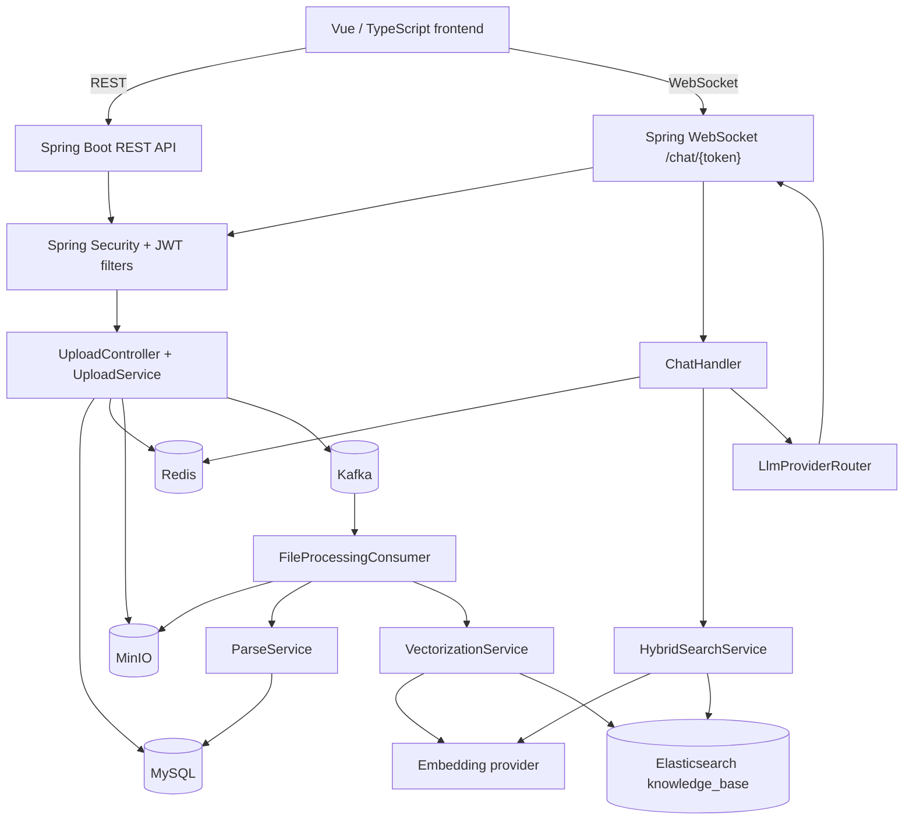
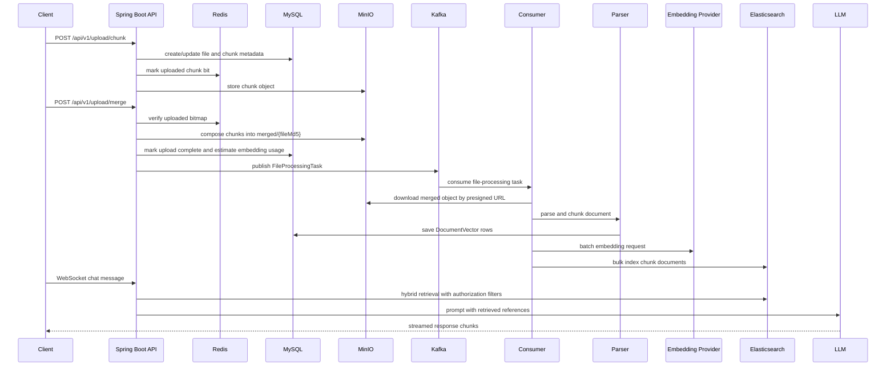

# RAG Smart FlowPAI

RAG Smart FlowPAI is a full-stack knowledge-base application built around a Java/Spring Boot backend. Users upload documents, the backend stores the original files, parses them into text chunks, generates embeddings, indexes the chunks in Elasticsearch, and retrieves permission-aware context for WebSocket-based chat responses.

The repository is not only an LLM chat UI. Most of the interesting work is in the backend: resumable upload state, object storage, asynchronous ingestion, document parsing, Elasticsearch indexing, organization-aware authorization, JWT security, usage quotas, rate limits, and admin-facing operational APIs.

## Stack

| Area | Implementation |
| --- | --- |
| Backend | Java 17, Spring Boot 3.4, Spring MVC, Spring Security, Spring WebSocket, WebFlux `WebClient` |
| Persistence and infrastructure | MySQL, Redis, Kafka, Elasticsearch 8, MinIO |
| Document processing | Apache Tika, PDFBox, HanLP |
| Retrieval and generation | OpenAI-compatible chat completions, configurable LLM providers, OpenAI-compatible embedding endpoint |
| Frontend | Vue 3, TypeScript, Vite, Pinia, Vue Router, Naive UI, UnoCSS |
| Testing | JUnit 5, Spring Boot Test, H2, Mockito |

## What The System Does

The application supports a private or organization-scoped document knowledge base:

- Authenticated users upload supported document files in chunks.
- The backend records upload metadata in MySQL and chunk state in Redis.
- Chunks are stored in MinIO and composed into a final object after upload completion.
- A Kafka task triggers asynchronous parsing and vectorization.
- Parsed chunks are stored in MySQL and indexed into the `knowledge_base` Elasticsearch index.
- Chat requests run permission-aware retrieval before calling an active LLM provider.
- Responses stream back to the frontend over WebSocket.
- Admin APIs manage users, organization tags, invite codes, provider settings, rate limits, usage dashboards, recharge packages, and knowledge-base operations.

## Architecture


```mermaid
flowchart TB
    FE[Vue / TypeScript frontend]
    API[Spring Boot REST API]
    WS["Spring WebSocket /chat/{token}"]
    AUTH[Spring Security + JWT filters]
    UPLOAD[UploadController + UploadService]
    MINIO[(MinIO)]
    MYSQL[(MySQL)]
    REDIS[(Redis)]
    KAFKA[(Kafka)]
    CONSUMER[FileProcessingConsumer]
    PARSE[ParseService]
    VECTOR[VectorizationService]
    EMBED[Embedding provider]
    ES[(Elasticsearch knowledge_base)]
    CHAT[ChatHandler]
    SEARCH[HybridSearchService]
    LLM[LlmProviderRouter]

    FE -->|REST| API
    FE -->|WebSocket| WS
    API --> AUTH
    WS --> AUTH
    AUTH --> UPLOAD
    UPLOAD --> MYSQL
    UPLOAD --> REDIS
    UPLOAD --> MINIO
    UPLOAD --> KAFKA
    KAFKA --> CONSUMER
    CONSUMER --> MINIO
    CONSUMER --> PARSE
    PARSE --> MYSQL
    CONSUMER --> VECTOR
    VECTOR --> EMBED
    VECTOR --> ES
    WS --> CHAT
    CHAT --> REDIS
    CHAT --> SEARCH
    SEARCH --> EMBED
    SEARCH --> ES
    CHAT --> LLM
    LLM --> WS
```

## Storage Responsibilities

| Component | Responsibility in this codebase |
| --- | --- |
| MySQL | Users, organization tags, upload metadata, chunk metadata, parsed text chunks, invite codes, provider config, recharge records, token records, usage-related entities |
| Redis | Upload bitmap state, chat conversation history, current conversation IDs, organization-tag caches, rate-limit counters, quota and usage counters, PDF single-page preview cache |
| MinIO | Uploaded chunks under `chunks/{fileMd5}/{chunkIndex}` and merged files under `merged/{fileMd5}` |
| Kafka | Asynchronous file-processing handoff after upload merge; configured with retry and a dead-letter topic |
| Elasticsearch | `knowledge_base` index containing chunk text, dense vectors, page/anchor metadata, model version, owner, organization tag, and visibility fields |

## Backend Data Flow


```mermaid
sequenceDiagram
    participant Client
    participant API as Spring Boot API
    participant Redis
    participant MySQL
    participant MinIO
    participant Kafka
    participant Consumer
    participant Parser
    participant Embed as Embedding Provider
    participant ES as Elasticsearch
    participant LLM

    Client->>API: POST /api/v1/upload/chunk
    API->>MySQL: create/update file and chunk metadata
    API->>Redis: mark uploaded chunk bit
    API->>MinIO: store chunk object
    Client->>API: POST /api/v1/upload/merge
    API->>Redis: verify uploaded bitmap
    API->>MinIO: compose chunks into merged/{fileMd5}
    API->>MySQL: mark upload complete and estimate embedding usage
    API->>Kafka: publish FileProcessingTask
    Kafka->>Consumer: consume file-processing task
    Consumer->>MinIO: download merged object by presigned URL
    Consumer->>Parser: parse and chunk document
    Parser->>MySQL: save DocumentVector rows
    Consumer->>Embed: batch embedding request
    Consumer->>ES: bulk index chunk documents
    Client->>API: WebSocket chat message
    API->>ES: hybrid retrieval with authorization filters
    API->>LLM: prompt with retrieved references
    LLM-->>Client: streamed response chunks
```

## Document Ingestion

Upload is implemented by `UploadController` and `UploadService`.

1. The frontend computes and sends `fileMd5`, `chunkIndex`, `totalSize`, `fileName`, optional `orgTag`, and `isPublic`.
2. On the first chunk, the backend validates the extension with `FileTypeValidationService`.
3. If no organization tag is supplied, the upload uses the user's primary organization tag.
4. Non-admin uploads are checked against the upload size limit configured on the target `OrganizationTag`, when one is set.
5. Each chunk is written to MinIO, recorded in `chunk_info`, and marked in Redis using a bitmap key shaped like `upload:{userId}:{fileMd5}`.
6. Upload status reads the bitmap in one Redis fetch and decodes uploaded chunk indexes locally.
7. Merge validates that all expected chunks exist, composes them in MinIO into `merged/{fileMd5}`, deletes chunk objects best-effort, clears the Redis upload bitmap, and marks the file upload complete.
8. Merge estimates embedding usage by parsing the merged file stream.
9. A transactional Kafka send publishes `FileProcessingTask` with file path, owner, org tag, and visibility.

The file-processing consumer downloads the merged file, parses it, saves chunks, embeds them, bulk-indexes Elasticsearch documents, and writes actual token/chunk counts back to the upload row.

## Parsing And Chunking

`ParseService` is the main parsing entry point.

- PDF files are detected by `%PDF-` header, parsed page by page using PDFBox, and stored with page numbers.
- Repeated PDF boundary lines are filtered as likely headers/footers.
- Non-PDF files are parsed with Apache Tika through a streaming content handler.
- Large non-PDF text is handled as parent chunks, then split into smaller child chunks.
- Chunking prefers paragraph and sentence boundaries.
- HanLP is used as a fallback for very long Chinese sentences; if HanLP fails, the code falls back to character splitting.
- Saved chunks include `fileMd5`, `chunkId`, `textContent`, `pageNumber`, `anchorText`, `userId`, `orgTag`, and `isPublic`.

## Vectorization And Indexing

`VectorizationService` loads parsed chunks from MySQL, calls `EmbeddingClient` in batches, verifies that the embedding count matches the chunk count, then writes `EsDocument` records to Elasticsearch through `ElasticsearchService.bulkIndex`.

`EmbeddingClient` uses the active embedding provider from `ModelProviderConfigService`. The default configuration is OpenAI-compatible and points to DashScope-compatible embeddings unless overridden through persisted provider config or environment variables.

The Elasticsearch index is initialized from `src/main/resources/es-mappings/knowledge_base.json`. It contains:

- `textContent` analyzed with IK analyzers.
- `vector` as a 2048-dimensional cosine dense vector.
- metadata fields for file ID, chunk ID, page number, model version, owner, org tag, and visibility.

## Hybrid Retrieval

`HybridSearchService.searchWithPermission` is the permission-aware retrieval path used by chat.

1. Resolve the user and compute effective organization tags through `OrgTagCacheService`.
2. Generate a query embedding through `EmbeddingClient`.
3. If embedding fails, fall back to text-only Elasticsearch search.
4. Run Elasticsearch KNN recall against `vector`.
5. Require a text match on `textContent`.
6. Apply authorization filters in Elasticsearch for owner, public documents, or effective organization tags.
7. Apply a second-stage rescore using a stricter `textContent` match with `Operator.And`.
8. Attach file names from MySQL before returning results.

The retrieval mode is returned as `HYBRID` or `TEXT_ONLY`, and chat stores reference mappings so the frontend can request citation details later.

## Authentication And Permissions

Authentication is JWT-based and stateless.

- `SecurityConfig` protects REST APIs by role and installs `JwtAuthenticationFilter`.
- `JwtAuthenticationFilter` reads `Authorization: Bearer ...`, validates the token, refreshes tokens when configured logic allows it, and sets the Spring Security authentication.
- `OrgTagAuthorizationFilter` extracts `userId`, `role`, and `orgTags` request attributes for upload/document/search APIs.
- Resource checks are based on the `file_upload` table for document-style URLs.
- Users have comma-separated org tags and a primary org tag.
- New users receive a private organization tag and the default tag during registration.
- Admin users can create org tags, assign org tags, and manage users through admin APIs.

Document access is allowed when a file is owned by the user, marked public, or belongs to an organization tag in the user's effective tag set. Effective tags include direct tags, parent tags, and the default tag.

## Chat Flow

The WebSocket endpoint is `/chat/{token}`. `ChatWebSocketHandler` validates the JWT token from the path and maps the session to the token's user ID.

For each chat message, `ChatHandler`:

1. Checks per-user chat rate limits.
2. Loads or creates a Redis-backed current conversation ID.
3. Reads recent conversation history from Redis.
4. Runs `HybridSearchService.searchWithPermission`.
5. Builds a reference context for the LLM prompt.
6. Streams through `LlmProviderRouter`.
7. Sends chunks to the WebSocket client as JSON.
8. Detects completion, sends a completion event, and stores the latest conversation messages and reference mappings in Redis.

`LlmProviderRouter` uses active provider settings from `ModelProviderConfigService`, reserves estimated token usage before the request, and settles usage after streaming based on provider usage data when available.

## API Surface

| Prefix | Purpose |
| --- | --- |
| `/api/v1/users` | Registration, login, current user, org tags, user usage, token records, logout |
| `/api/v1/auth` | Token refresh |
| `/api/v1/upload` | Chunk upload, upload status, merge, supported file types |
| `/api/v1/documents` | Accessible files, uploaded files, delete, reindex, download, preview, citation detail |
| `/api/v1/search` | Hybrid search |
| `/api/v1/chat` | WebSocket token metadata for stop commands |
| `/api/v1/users/conversation` | Conversation history |
| `/api/v1/admin` | User, knowledge-base, org-tag, invite-code, model-provider, rate-limit, usage, recharge administration |
| `/api/v1/recharge` | Recharge packages, order creation, callbacks, order lookup |

## Frontend

The frontend lives in `frontend/` and is a Vue 3 + TypeScript Vite application. Implemented views include chat, chat history, knowledge-base upload/search/management, user management, org-tag management, model-provider settings, invite codes, usage monitoring, recharge, and personal center.

The knowledge-base upload UI sends both `public` and `isPublic` values, while the backend upload endpoint consumes `isPublic`.

## Docker Quick Start

The root `compose.yaml` builds and starts the frontend, backend, MySQL, Redis, Kafka, MinIO, and Elasticsearch. Docker Engine with Compose v2 is the only runtime prerequisite. Allocate at least 4 GB of memory to Docker because Elasticsearch and the Java backend run together.

### Configure

```bash
cp .env.example .env
```

Before exposing the application outside your machine, replace the example database, Redis, MinIO, Elasticsearch, JWT, and administrator credentials in `.env`. `JWT_SECRET_KEY` must decode to 16, 24, or 32 bytes; generate one with `openssl rand -base64 32`.

The default configuration creates an administrator on the first start:

```text
username: admin
password: change-this-admin-password
```

Change that password in `.env` before the first start. Once the administrator exists, set `ADMIN_BOOTSTRAP_ENABLED=false`.

### Start

```bash
docker compose up --build -d
docker compose ps
```

The first build downloads container images, Maven/npm dependencies, and the Elasticsearch IK analysis plugin, so it can take several minutes.

| Service | URL |
| --- | --- |
| Web application | `http://localhost:8080` |
| Backend API | `http://localhost:8081` |
| MinIO API | `http://localhost:9000` |
| MinIO console | `http://localhost:9001` |
| Elasticsearch | `http://localhost:9200` |

MySQL creates the `PaiSmart` database, Hibernate creates or updates tables, the application creates Kafka topics and the Elasticsearch index, and the `minio-init` service creates the `uploads` bucket.

Check startup logs with:

```bash
docker compose logs -f backend frontend
```

Stop the stack without deleting data:

```bash
docker compose down
```

To also remove the local database, object storage, Kafka, Redis, and Elasticsearch data:

```bash
docker compose down -v
```

The last command permanently deletes the Compose volumes.

### Model Providers

The stack starts without model API keys. In that state, authentication, administration, document storage, and the UI are available, but chat and vectorization cannot call external providers.

Set `DEEPSEEK_API_KEY` and `EMBEDDING_API_KEY` in `.env`, then recreate the backend:

```bash
docker compose up -d --force-recreate backend
```

`KNOWLEDGE_BOOTSTRAP_ENABLED` defaults to `false`. After configuring an embedding provider, set it to `true` to import `docs/paismart.pdf` during backend startup.

### Source Development

The same Compose stack can run only the infrastructure while the applications run from source:

```bash
docker compose up -d mysql redis kafka minio minio-init elasticsearch
mvn spring-boot:run
```

In another terminal:

```bash
cd frontend
pnpm install
pnpm dev
```

Source development requires JDK 17, Maven 3.8+, Node.js 18.20+, and pnpm 8.7+. The backend loads the root `.env` through `DotenvEnvironmentPostProcessor`.

## Testing

Backend tests are under `src/test/java`.

```bash
mvn test
```

The test profile uses H2 in MySQL compatibility mode and disables startup knowledge bootstrap. Many service tests use Mockito for collaborators such as repositories, MinIO, Elasticsearch, Kafka, and provider clients.

Current coverage focuses on:

- JWT refresh behavior.
- User registration and org-tag behavior.
- Invite-code logic.
- Usage quota and dashboard calculations.
- Rate-limit configuration.
- Model-provider configuration.
- Parse-service chunking behavior.
- Upload-controller behavior.
- Bootstrap knowledge initialization.
- Conversation service behavior.

`UploadServicePerformanceTest` is explanatory: it logs the expected reason for the Redis bitmap optimization but does not run a reproducible benchmark.

Frontend scripts include:

```bash
cd frontend
pnpm typecheck
pnpm lint
pnpm build
```

There is also a Playwright spec at `frontend/playwright-kb-column.spec.ts`.

## Current Limitations

- Elasticsearch public-field naming needs verification. The mapping defines `isPublic`, while `HybridSearchService` filters on `public`. If Jackson indexes the field as `public`, the mapping and query should be aligned; if it indexes `isPublic`, public-document filtering in Elasticsearch will not match as intended.
- `SearchController` falls back to the non-permission `search(query, topK)` path when `userId` is absent, despite a comment saying anonymous search should return only public content. The Spring Security configuration requires authentication for `/api/v1/search/**`, but the fallback should still be treated carefully.
- `OrgTagAuthorizationFilter` only resolves resource metadata from `file_upload`; the code has a TODO for other resource types.
- Kafka retry and DLT are configured through `DefaultErrorHandler`, but there are no tests proving end-to-end DLT behavior against a real Kafka broker.
- The root Compose stack installs the Elasticsearch IK plugin from an external URL on first startup, so the initial Elasticsearch start requires internet access.
- `docs/docker-compose.yaml` is the older infrastructure-only configuration. Use the root `compose.yaml` for the complete application.
- The local helper script `infra.sh` contains machine-specific paths and is not used by the root Compose stack.
- Token accounting uses estimation before provider responses and settles with provider-reported usage when available; estimates are heuristic, not tokenizer-exact.
- Switching the active embedding provider is blocked when it would require re-embedding existing content; there is no migration job for that path yet.
- The chat completion monitor infers stream completion by watching response length over time instead of using an explicit provider completion signal.
- Tests cover important units and controller behavior, but there is no full integration test that starts MySQL, Redis, Kafka, MinIO, Elasticsearch, and provider mocks together.

## Repository Layout

```text
src/main/java/com/yizhaoqi/smartpai
  client/       LLM and embedding API clients
  config/       Spring Security, Kafka, Redis, MinIO, Elasticsearch, WebSocket, quota, bootstrap config
  consumer/     Kafka document-processing consumer
  controller/   REST API controllers
  entity/       Elasticsearch/search DTOs
  model/        JPA entities and task models
  repository/   Spring Data repositories
  service/      Upload, parsing, vectorization, retrieval, chat, quota, user, document, admin services
  utils/        JWT, password, crypto, logging, JSON, migration helpers

src/main/resources
  application*.yml
  es-mappings/knowledge_base.json

frontend/
  Dockerfile
  nginx.conf    SPA hosting plus REST and WebSocket reverse proxy
  Vue 3 / TypeScript frontend application

Dockerfile      Spring Boot multi-stage image build
compose.yaml    Complete local stack
.env.example    Compose and application configuration template

docs/
  docker-compose.yaml   Legacy infrastructure-only stack
  databases/ddl.sql
  bootstrap knowledge documents and deployment notes
```

## License

This repository is licensed under the terms in `LICENSE`.
